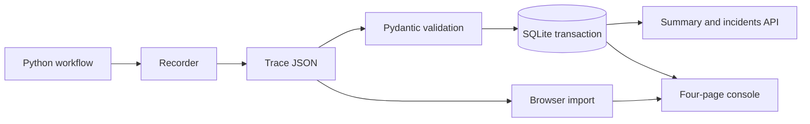

# Agent Run Monitor

Agent Run Monitor 将 Python 工作流的步骤记录转成可检查的运行时间线、异常定位和成本预算报告。它支持实际采集、JSON 导入、SQLite 持久化和四个联动页面。

[在线演示](https://helia-zhong.github.io/Personal-AI-Replication-Manual/Agent-Run-Monitor/web/index.html) · [验证记录](docs/validation.md)

## 运行方式

| 模式 | 数据来源 | 保存位置 |
| --- | --- | --- |
| 演示样本 | 3 条固定轨迹、14 个步骤 | 项目文件 |
| 本地导入 | 用户选择的 Trace JSON | 当前浏览器 localStorage |
| SQLite 工作区 | FastAPI 接收的 Trace JSON | 本地 .monitor/runs.sqlite3 |

GitHub Pages 支持演示和浏览器导入。本地 FastAPI 同时提供页面和接口，工作区初始为空；接口不可用时显示错误，不会用样本冒充真实运行。数据源选择在四页间保留。

## 本地启动

推荐 Python 3.12；Windows 在项目目录运行：

```powershell
.\start.ps1
# 端口占用时
.\start.ps1 -Port 8041
```

启动后访问 http://127.0.0.1:8040/ 。脚本创建独立虚拟环境并安装锁定依赖。

其他系统：

```bash
python -m venv .venv
source .venv/bin/activate
python -m pip install -r requirements.lock
python -m uvicorn backend.app:app --host 127.0.0.1 --port 8040
```

仅查看演示可直接打开 `web/index.html`，或使用静态服务器；文件模式下存储行为取决于浏览器。

## 采集实际工作流

随附脚本调用同一仓库里的 RAG BM25 引擎，完成读取语料、建立索引、并发查询和引用检查。耗时来自 `perf_counter`，不调用 LLM、不估算 Token 或账单。

```powershell
.venv\Scripts\python.exe scripts/capture_rag.py --output .monitor/captured.json
.venv\Scripts\python.exe scripts/capture_rag.py --inject-failure --output .monitor/failure.json
```

第二条命令注入明确标记的受控异常，用来检查失败诊断链路，不代表模型自身失败。在页面的 SQLite 工作区选择“导入 Trace”，或者通过接口导入：

```powershell
$trace = Get-Content -Raw .monitor/captured.json
Invoke-RestMethod http://127.0.0.1:8040/api/runs -Method Post -ContentType 'application/json; charset=utf-8' -Body ([Text.Encoding]::UTF8.GetBytes($trace))
```

自己的 Python 程序可以复用 `backend/recorder.py`：

```python
from recorder import Recorder  # backend/ on PYTHONPATH

recorder = Recorder("document_agent", "Check source references")
with recorder.step("Search", agent="retriever", tool="local_search") as span:
    results = search_documents(question)  # Your existing application function
    span["notes"] = f"Retrieved {len(results)} references"
    # Only fill tokens_in, tokens_out and cost_usd when actually recorded.
recorder.export("trace.json")
```

SDK 不吞掉业务异常；失败步骤会被记录并重新抛出。异常备注默认只保留异常类型，调用方负责脱敏自定义备注。所有步骤结束后再导出。当前 SDK 面向同步 Python 代码及线程池，尚未实现异步 Span 和 OpenTelemetry 协议适配。

## Trace 数据契约

完整字段见 `backend/contracts.py`；示例见 `data/sample_runs.json`。HTTP POST 使用 `{"runs": [...]}`，浏览器和 CLI 同时接受运行数组。

- run_id / step.id：ASCII 字母、数字、点、下划线或连字符，最多 100 字符；步骤 ID 在单次运行内唯一。
- started_at：含时区的 ISO 时间；只接收终态运行，步骤状态为 success / failed。
- duration_ms：非负有限数值；start_ms 为相对运行开始的偏移。全步骤提供偏移或全部省略。
- Token / cost_usd：未记录使用 null；已知为零可以填 0，两者不会混为一谈。
- 单批 1–100 条运行，每条 1–200 个步骤，导入文件最多 2 MB。
- 规范化后的同 ID 同内容重复导入返回 duplicates；同 ID 不同内容返回 409，整个批次回滚，原记录不变。
- source 为导入方声明的 sample / measured / imported，属于元数据，不是来源真实性认证。

## 页面与指标

| 页面 | 可检查内容 |
| --- | --- |
| 运行总览 | 数据源、运行筛选、健康度、P95、工具调用、告警 |
| Trace 详情 | 按实际 start_ms 绘制 Waterfall、失败步骤跳转、资源和 JSON 导出 |
| 异常中心 | 严重级别、稳定的运行和步骤 ID、具体异常记录、修复建议 |
| 成本性能 | 已记录成本、Token 完整性、预算门禁和独立假设情景 |

端到端耗时为 `max(start_ms + duration_ms)`，包括首步前和步骤间的空隙；步骤工作量为所有 duration_ms 之和。无偏移的旧样本按顺序累加。并行步骤不再被当作串行端到端耗时。P95 使用 nearest-rank 法，小样本下通常接近最大值。

异常规则保持原有基线：步骤失败为高危、重试 >= 2 为中危、步骤耗时超过中位数两倍为中危、单步成本 >= $0.015 为低危。存在失败运行或高危异常时健康状态强制 REVIEW。

成本和 Token 汇总仅累加已记录部分，API 同时返回 cost_complete / tokens_complete。页面在缺失数据时标记“未记录”，成本未知且延迟未超限时预算为 UNKNOWN。优化情景是独立假设，不可相加，也不是实测节省金额。

## API 和 CLI

```text
GET  /health
POST /api/runs
GET  /api/runs
GET  /api/summary
GET  /api/runs/{run_id}/summary
GET  /docs
```

```bash
python scripts/analyze_runs.py
python scripts/analyze_runs.py --input .monitor/captured.json --output .monitor/analysis.json
python scripts/analyze_runs.py --run-id run-2026-07-research-002
python -m unittest discover -s backend -p 'test_*.py' -v
node --test tests/data.test.cjs
```

CLI 的 python 与 Node 测试使用同一虚拟环境；也可设置 MONITOR_PYTHON 指向该解释器。MONITOR_DB 可覆盖数据库路径。

## 架构



## 验证与限制

GitHub Actions 执行后端测试、前后端指标一致性测试，并实际采集一条带受控失败的 RAG 轨迹，保存 Trace 和分析报告作为 CI artifact。[验证细节](docs/validation.md)。

本版本是单机终态 Trace 观测工具，默认只绑定 127.0.0.1；尚无身份认证、租户隔离、流式事件和 OTLP 接口。浏览器导入保存在当前浏览器，SQLite 只在本机保存，两种模式的数据不会自动互相复制。使用团队部署前需补齐认证、留存策略和访问控制。

## License

[MIT License](../LICENSE)。
