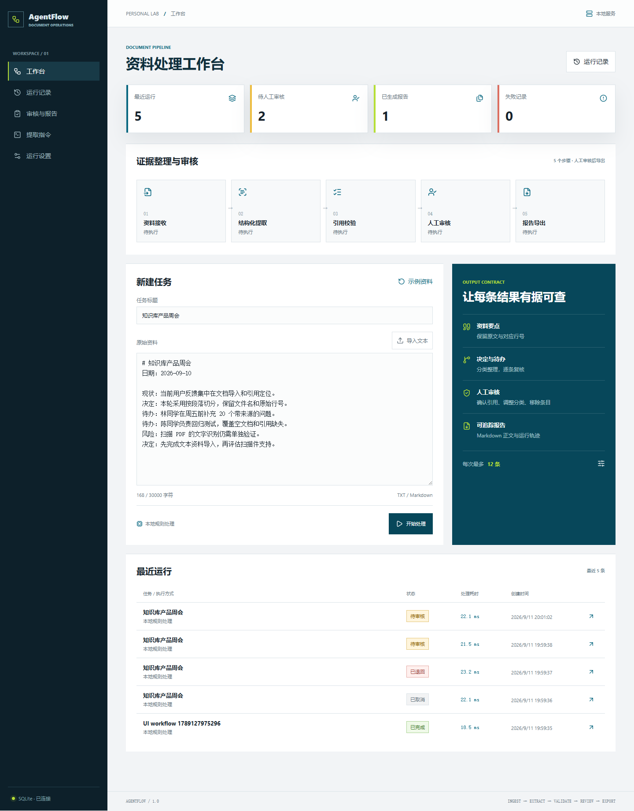

# AgentFlow Visualizer

面向资料整理的可追踪工作流：导入文本，提取资料要点、决定和待办，校验原文引用，经人工审核后导出报告。结果来自本次输入；运行配置、原始输出和审核结果分别保存。

[在线规则演示](https://helia-zhong.github.io/Personal-AI-Replication-Manual/AgentFlow-Visualizer/index.html) · [架构与设计取舍](docs/architecture.md) · [验证记录](docs/validation.md)

## 这一版完成了什么

- 五个页面：工作台、运行记录、审核与报告、提取指令、运行设置。
- TXT / Markdown 导入与粘贴，UTF-8 校验，最多 30,000 字符。
- 资料接收、提取、引用校验、人工审核和报告导出的顺序流程。
- 每条结果包含类别、原文片段及行号；引用必须是对应原文行中的连续片段。
- 审核时可调整分类、缩短引用、移除条目、填写备注、通过或退回。
- 后端以 SQLite 保存原始资料、SHA-256、配置快照、原始提取结果、审核后结果和事件。
- 任务取消、连接与超时重试、服务重启后的中断标记、手动重新运行与父任务关联。
- Ollama 模型调用通过异步 HTTP 执行，结构化结果经 Pydantic 和原文匹配双重校验。
- 界面展示实测步骤耗时；Token 仅采用模型接口实际返回的数据，不计算虚构成本。

## 三种运行方式

| 方式 | 如何执行 | 记录保存 | 适用场景 |
| --- | --- | --- | --- |
| 浏览器规则演示 | JavaScript 对输入文本做规则提取 | 当前浏览器 LocalStorage | GitHub Pages、直接打开 HTML |
| 本地规则处理 | Python 对输入文本做规则提取 | SQLite | 无模型环境下完整体验后端流程 |
| Ollama 模型 | 本地后端调用配置的 Ollama 模型 | SQLite | 用语言模型提取和分类资料 |

**GitHub Pages 展示浏览器规则演示，不运行 Python 或语言模型。** 模型名称和自定义提取指令仅用于 Ollama 模式。模型不可用时任务会失败并保留原因，不切换到预设回答。

## 本地运行

需要 Python 3.11 或更高版本；本次验证使用 Python 3.12。以下命令均在 AgentFlow-Visualizer 目录执行。

Windows PowerShell：

~~~powershell
python -m venv .venv
.\.venv\Scripts\python.exe -m pip install -r requirements.lock
.\.venv\Scripts\python.exe -m uvicorn backend.app:app --host 127.0.0.1 --port 8091
~~~

macOS / Linux：

~~~bash
python3 -m venv .venv
.venv/bin/python -m pip install -r requirements.lock
.venv/bin/python -m uvicorn backend.app:app --host 127.0.0.1 --port 8091
~~~

打开 [本地工作台](http://127.0.0.1:8091)。API 文档位于 [本地 /docs](http://127.0.0.1:8091/docs)。Windows 也可运行 `start.ps1`，已有虚拟环境会被复用。端口被占用时通过 `-Port 8093` 指定其他端口。

不启动后端时，直接打开 `index.html` 即可操作规则演示。界面和图标均为本地资源，无 CDN 或构建步骤。纯浏览器记录与服务端记录相互独立。

## 使用本地语言模型

1. 按 [Ollama 官方文档](https://docs.ollama.com/quickstart) 安装并启动服务，准备一个支持 JSON 结构化输出的本地模型。
2. 在“运行设置”选择 Ollama 模型，填写已安装模型的完整名称并保存。
3. 在“提取指令”调整任务指令，然后从工作台提交新资料。
4. 检查引用、分类及运行事件，人工审核通过后下载 Markdown 报告。

适配器遵循 [Chat API](https://docs.ollama.com/api/chat) 与 [Structured Outputs](https://docs.ollama.com/capabilities/structured-outputs)。
默认连接 `http://127.0.0.1:11434`；可在启动后端前设置 `AGENTFLOW_OLLAMA_URL` 更改地址。服务地址不接受浏览器端任意填写。

本次机器未安装或运行 Ollama；已验证 HTTP 请求契约、响应校验、超时和重试，尚未完成真实模型的质量与速度评测。

## 走通一次完整流程

1. 在工作台导入自己的 TXT / Markdown，或使用内置示例。
2. 点击“开始处理”，观察任务进入“待审核”。
3. 点击结果的 L 行号跳转到原文，调整分类或移除无关条目。
4. 勾选已核对，通过审核并导出 Markdown。完整运行 JSON 包含原文和配置，可供复盘。
5. 从运行记录再次打开任务。刷新页面或重启服务后，已保存结果仍可读取。

提取上限是 1–30 条。规则模式优先保留带动作或决定关键词的行，再按原始行号排列；它没有语义理解能力。引用存在仅说明文本来自原文，不意味着原文陈述真实或分类一定正确。

## API

| 方法 | 路径 | 行为 |
| --- | --- | --- |
| GET | /api/health | 服务标识与存储方式 |
| GET / PUT | /api/settings | 查询 / 保存下次运行配置 |
| GET / POST | /api/runs | 最近 100 条运行摘要 / 提交新任务 |
| GET | /api/runs/{id} | 原文、配置、步骤、事件及结果 |
| POST | /api/runs/{id}/cancel | 取消排队、处理或待审核任务 |
| POST | /api/runs/{id}/retry | 以原配置创建子任务，保留父任务 |
| POST | /api/runs/{id}/review | 使用版本号提交通过或退回 |
| GET | /api/runs/{id}/report | 获取审核通过后的 Markdown |

提交审核需要最新 `version`。过期、重复审核或对已取消任务审核会返回 HTTP 409；引用不匹配返回 422。无需认证的服务限定本机使用，不建议直接暴露到公网。

## 项目结构

~~~text
AgentFlow-Visualizer/
  backend/
    app.py             FastAPI、静态资源白名单、API
    contracts.py       输入、输出、审核契约与规则处理
    runtime.py         任务调度、Ollama 适配器、SQLite
  assets/              本地 Lucide 图标及许可证
  docs/                架构、验证记录与界面截图
  scripts/             图标打包、可复现验证
  tests/               Python、JavaScript 与 Playwright 测试
  index.html           工作台
  runs.html            运行记录
  review.html          审核与报告
  prompts.html         提取指令
  settings.html        运行设置
  app.js               交互、API 客户端、演示运行
  engine.js            浏览器规则与引用校验
  styles.css           响应式视觉
  requirements.lock    本次验证的 Python 依赖
  start.ps1            Windows 本地启动入口
~~~

## 测试

Python：

~~~powershell
.\.venv\Scripts\python.exe -m unittest discover -s tests -p "test_*.py" -v
~~~

JavaScript 与浏览器：

~~~powershell
npm ci
npm test
npx playwright install chromium
$env:AGENTFLOW_TEST_PYTHON = ".venv\Scripts\python.exe"
npm run test:ui
~~~

macOS / Linux 可使用 `AGENTFLOW_TEST_PYTHON=.venv/bin/python npm run test:ui`。
UI 测试自行在 8092 端口启动独立后端，使用 `.agentflow/ui-tests.sqlite3`。所有测试资料都是合成资料，不会调用真实模型。
已安装 Edge 时，可设置 `PLAYWRIGHT_CHANNEL=msedge` 使用其无头测试实例。

图标更新：`npm ci && npm run vendor`。前端无需安装 Node.js 即可运行。

## 运行边界

- 当前是单用户、单进程的固定顺序工作流；没有多租户、任意 DAG 编辑、分布式队列或自主工具调用。
- 同时最多执行 2 个任务，最多接收 20 个未结束的后台任务。请勿用多个 Uvicorn worker 共享同一数据库。
- 数据库默认在 `.agentflow/runs.sqlite3`，可以用 `AGENTFLOW_DB` 修改位置。数据库与虚拟环境已加入忽略规则。
- 服务重启后，处理中任务变为失败等待重新运行；待审核和已完成任务保留，不重复调用模型。
- 手动重试创建新任务并从头执行，继承原配置。要修改配置或原文，请从工作台新建任务。
- 浏览器演示保存最多 100 条记录。不同浏览器对 file:// 存储的隔离方式可能不同，长期保存建议使用本地后端。
- 此版本导入纯文本和 Markdown；扫描 PDF、OCR、外部搜索及附件解析不在当前支持范围内。
- 新版没有迁移旧版模拟运行记录；旧的 LocalStorage 键未被删除，历史代码仍可通过 Git 提交查看。

## License

项目代码使用根目录 [MIT License](../LICENSE)。Lucide 图标遵循 [ISC License](assets/lucide.LICENSE)。
