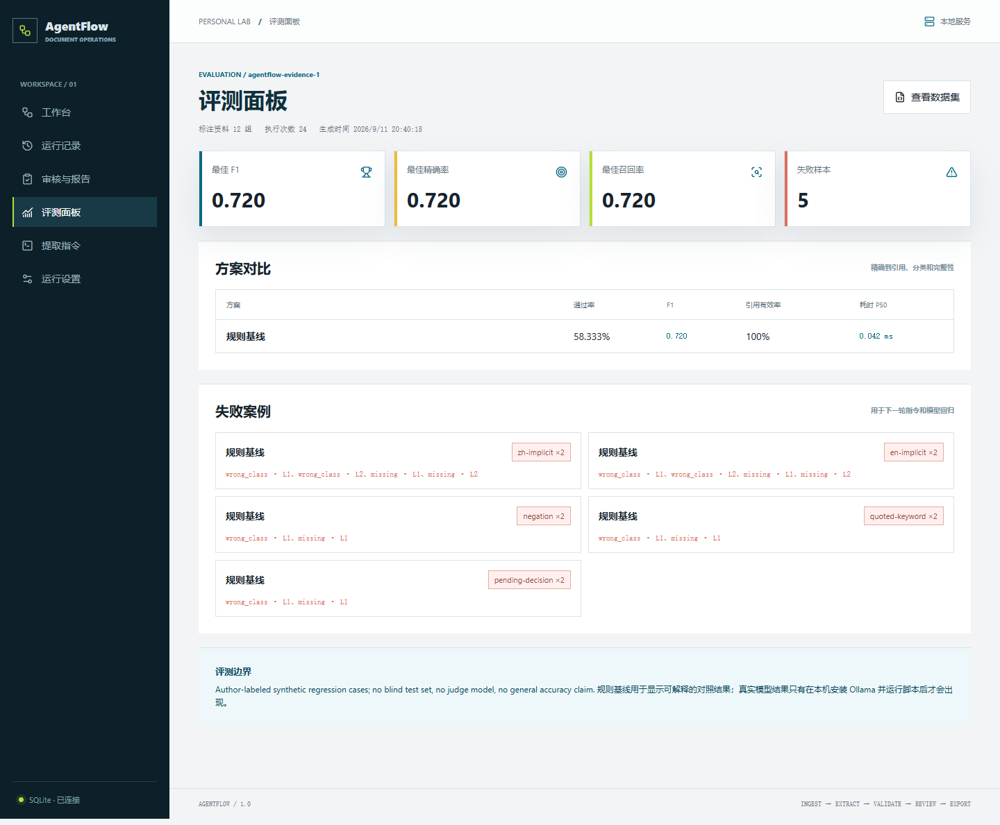
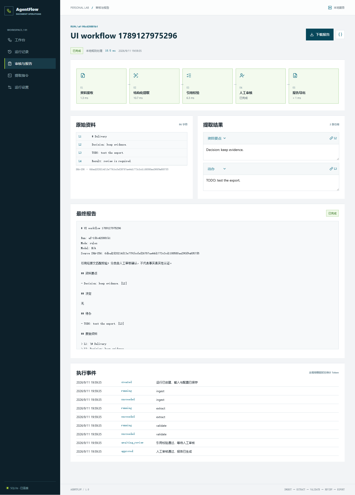

# AgentFlow 1.0 验证记录

本地验证日期：2026-09-11。环境：Windows、Python 3.12.14、Node.js 24、Playwright 1.63、Edge 无头实例。

## 已通过

| 范围 | 数量 | 覆盖内容 |
| --- | ---: | --- |
| Python API / 运行时 | 13 | 输入校验、审批门禁、过期审核、引用校验、取消、重试、配置快照、重启恢复、模型 HTTP 契约与超时 |
| JavaScript 引擎 | 3 | 输入变化、行号、分类、重复 / 非原文引用、报告转义 |
| Playwright UI | 7 | 新建到审核导出、刷新恢复、退回重试、设置保存、离线运行、服务异常恢复、手机导入及全部页面布局 |
| 合成资料跨语言验证 | 4 | 中英文资料、Markdown 行号、带 HTML 的文本、完整审核报告流程 |

所有 UI 页面在 1440px 和 390px 宽度下检查了页面溢出和图标加载，并保存了截图。审核页还使用实际运行记录检查原文与提取结果的双栏 / 单栏布局。

## 评测基线

评测面板使用 `evals/cases.json` 的 12 组作者标注合成资料，每个样本重复 2 次。规则基线通过 14 / 24 次文档级检查，精确率、召回率和 F1 均为 0.720；原文引用有效率为 100%，空内容拒答正确率为 100%。失败集中在隐含语义、否定句和语境判断，正是后续模型 / Prompt 版本需要改善的部分。

这些数字只用于本项目的回归比较。数据集不是盲测集，评分器不使用模型裁判，也不能推出通用准确率。运行真实 Ollama 评测后，结果会同时保存每次模型输出、错误类型、延迟和接口返回的 Token 数，并由同一页面与规则基线对照。

## 可以复现的结果

运行：

~~~powershell
.\.venv\Scripts\python.exe scripts/check_workflow.py
~~~

详细数据保存在 [validation-results.json](validation-results.json)。
该脚本使用临时 SQLite 数据库和四组合成资料，检查预期分类、来源行号、前后端规则一致性与审核后报告生成。

此次步骤处理耗时中位数为 17.283 ms，包含步骤内的数据库写入开销，不包含人工等待时间。
这个数值只描述当前机器上的小样本规则处理，不是语言模型速度、生产吞吐量或准确率承诺；重复执行会有波动。

## 模型测试的边界

- HTTP 契约测试使用受控响应，验证 JSON Schema 请求、响应解析及实际返回的 Token 字段。
- 异步测试注入暂时连接失败、超时、错误引用和长时间等待，验证重试、取消与失败状态。
- 当前机器未安装或运行 Ollama，未完成真实模型推理测试，也没有模型质量对比结果。
- GitHub Actions 配置已加入仓库；本地结果不等同于远端 CI 成功，远端结果以 Actions 页面为准。

## 界面

手机端：[工作台](mobile.png) · [运行设置](mobile-settings.png)
